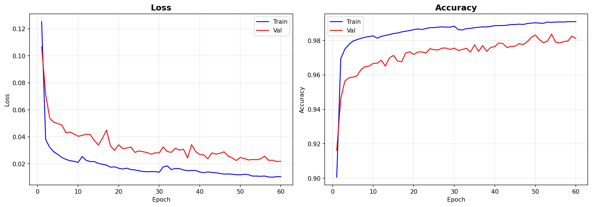
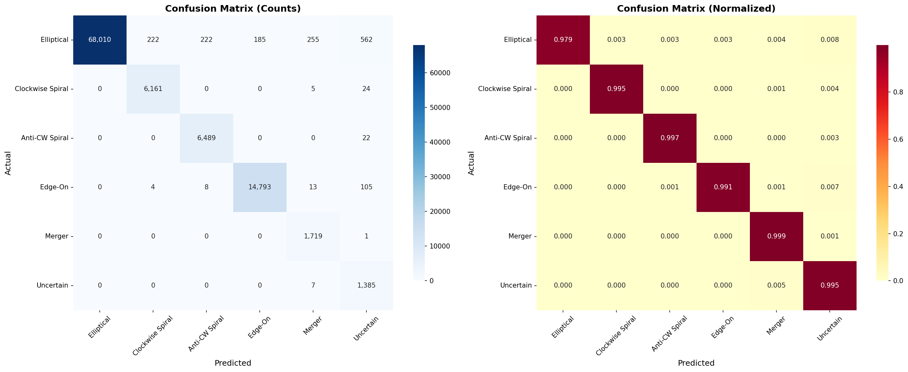

# 🌌 Galaxy Zoo Image Classification (JWST NASA Dataset)


Welcome to the **Galaxy Zoo Image Classification System**! This repository hosts a state-of-the-art deep learning model that automatically classifies images of galaxies into 7 distinct morphological categories. Trained using PyTorch and the EfficientNet-B0 architecture, this pipeline provides accurate classification of space phenomena, whether they are classical spirals, ellipticals, or irregular mergers.

## 🌟 The 7 Galaxy Classes

1. **Completely Round Smooth**: Perfectly spherical elliptical galaxy, no visible disk.
2. **In-Between Smooth**: Slightly elongated elliptical galaxy without spiral arms.
3. **Cigar-Shaped Smooth**: Highly elongated elliptical galaxy with a cigar-like shape.
4. **Edge-On Disk**: Disk galaxy viewed directly edge-on, appearing as a thin light band.
5. **Barred Spiral**: Spiral galaxy featuring a prominent central bar structure.
6. **Unbarred Spiral**: Classic spiral galaxy with arms emerging directly from the bulge.
7. **Irregular/Merger**: Disturbed, asymmetrical galaxy often indicating a recent merger or collision.

---

## 🚀 Quick Start Guide

### 1. Installation

Ensure you have Python 3.8+ installed, then run:

```bash
git clone https://github.com/Tirth-byte/GALAXY-ZOO.git
cd "Galaxy Zoo"
pip install -r requirements.txt
```

### 2. Dataset Preparation

The dataset can be automatically downloaded via Kaggle, or you can supply your own sorted image directories.

```bash
# Automated dataset download via Kaggle (make sure kaggle.json is set up in ~/.kaggle)
python dataset.py
```

### 3. Train the Model

```bash
python train.py
```

Training will build an `EfficientNet-B0` model using transfer learning. Outputs including model checkpoints and training diagnostic plots are automatically saved!

### 4. Run Inference (Predict)

```bash
python predict.py
```

Place new, unseen galaxy images into the `new_images/` directory. The predict script will classify them and generate comprehensive outputs in the `output/` directory, including a master CSV and beautifully formatted Excel file containing probabilities and class predictions for each image.

---

## 📊 Results & Artifacts

After training and testing, the system provides several insightful artifacts to gauge performance:

### Training History & Accuracy 📈
The `training_history.png` outlines the accuracy and loss curves for both the training and validation sets over epochs. EfficientNet quickly converges to high accuracy!



### Confusion Matrix 🎯
The `confusion_matrix.png` provides an in-depth look at where the model excels and which galaxy classes it occasionally confuses (e.g., in-between smooth vs round smooth).



---

## 📂 Project Architecture

- **`config.py`**: A centralized configuration file with all hyper-parameters, constants, paths, and training variables.
- **`dataset.py`**: Handles downloading data from Kaggle, building class folders, defining transformations (augmentations), and loading datasets into PyTorch Hash Loaders.
- **`model.py`**: Defines the `EfficientNet-B0` architecture layout, tweaking the final layers to predict across 7 distinct classes.
- **`train.py`**: The training loop. Implements Early Stopping, Cosine Annealing learning rate schedules, and cross-entropy evaluation.
- **`train_csv.py`**: Secondary pipeline logic.
- **`predict.py`**: Runs inference on raw images, parses the final logits to confidence scores, generates structured text output via CSVs and formatted Excel tables for stakeholder consumption.
- **`requirements.txt`**: Complete list of Python packages necessary to run the suite.

---

## ✨ Web Dashboard included

Open the included `index.html` file in your browser to experience a stunning, interactive dashboard presenting the project's features, classes, and predictive outcomes.

---

**Developed & maintained by Tirth-byte**  
*Explore the universe, one pixel at a time.*
